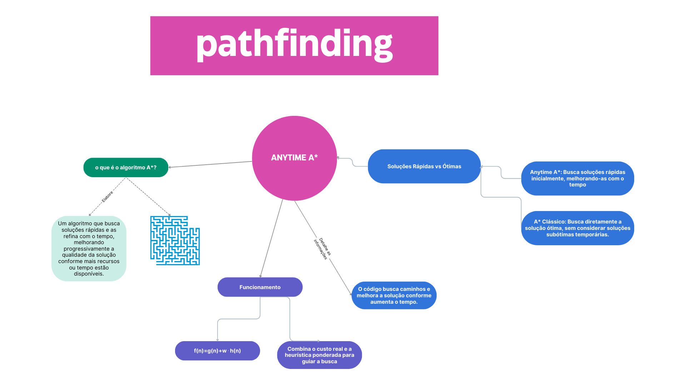

# Algoritmo Anytime A*

## Visão Geral

O `Anytime A*` é uma extensão do algoritmo de busca A* clássico. Ele é projetado para fornecer soluções rapidamente e melhorá-las iterativamente à medida que mais tempo está disponível. Diferentemente do A* tradicional, que para ao encontrar a solução ótima, o Anytime A* retorna uma solução subótima inicialmente e, em seguida, continua refinando-a até que o limite de tempo ou recursos seja atingido.

Isso torna o algoritmo altamente adequado para sistemas em tempo real, robótica e outras aplicações onde obter uma solução rápida, ainda que não perfeita, é crucial, seguido pelo refinamento gradual.
Principais Características

    Soluções rápidas iniciais: Produz uma solução viável inicial muito rapidamente.
    Aprimoramento incremental: Refina a solução à medida que mais tempo é permitido.
    Suboptimalidade ajustável: Utiliza um fator de ponderação ww que controla o equilíbrio entre velocidade e optimalidade.

## Explicação do Algoritmo

O algoritmo Anytime A* opera utilizando a seguinte função de custo modificada:
f(n)=g(n)+w⋅h(n)
f(n)=g(n)+w⋅h(n)

Onde:

    f(n)f(n) é o custo total estimado do caminho através do nó nn,
    g(n)g(n) é o custo real para chegar ao nó nn,
    h(n)h(n) é a estimativa heurística do custo de nn até o objetivo,
    ww é o fator de ponderação que prioriza soluções mais rápidas quando w>1w>1 e guia o algoritmo para a optimalidade quando w=1w=1.

Mecanismo de Funcionamento

    Solução Inicial: O algoritmo funciona como uma busca A* ponderada, encontrando uma solução que pode ser subótima, mas é obtida rapidamente.

    Processo de Refinamento: Após encontrar a solução inicial, o algoritmo reduz o valor de ww e continua a busca para melhorar a solução encontrando caminhos mais curtos.

    Critério de Parada: O algoritmo continua refinando a solução até convergir para a solução ótima ou até que um limite de tempo/recursos predefinido seja atingido.

Optimalidade

O algoritmo `Anytime A*` não é inicialmente ótimo devido ao fator de ponderação ww. No entanto, à medida que ww se aproxima de 1, o algoritmo converge para a solução ótima. Se for permitido tempo suficiente, ele eventualmente retornará o mesmo resultado que o A* tradicional.

    Fase inicial: Soluções rápidas, mas subótimas.
    Fase final: Conforme ww se aproxima de 1, a solução torna-se ótima.